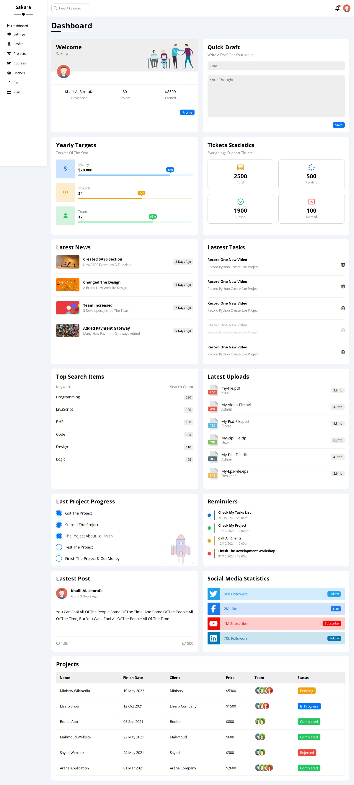
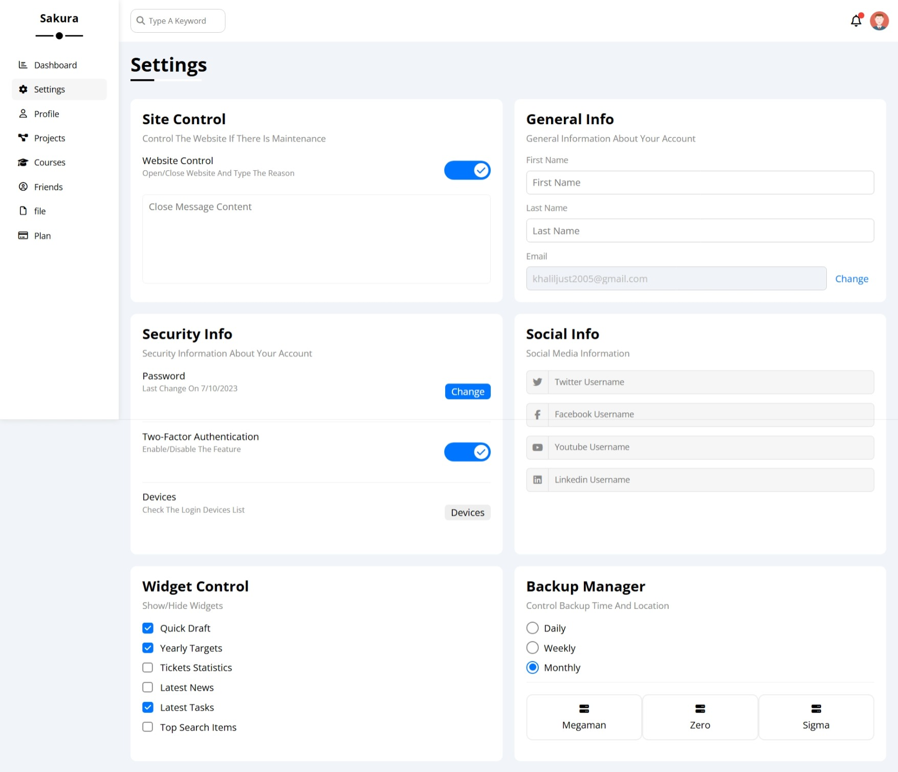
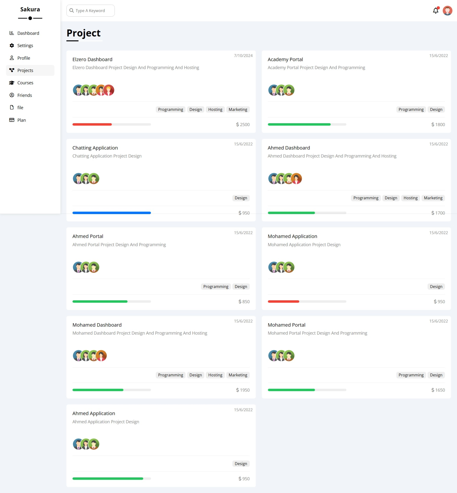
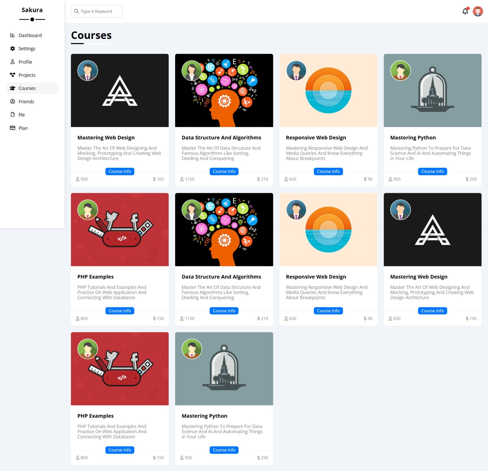
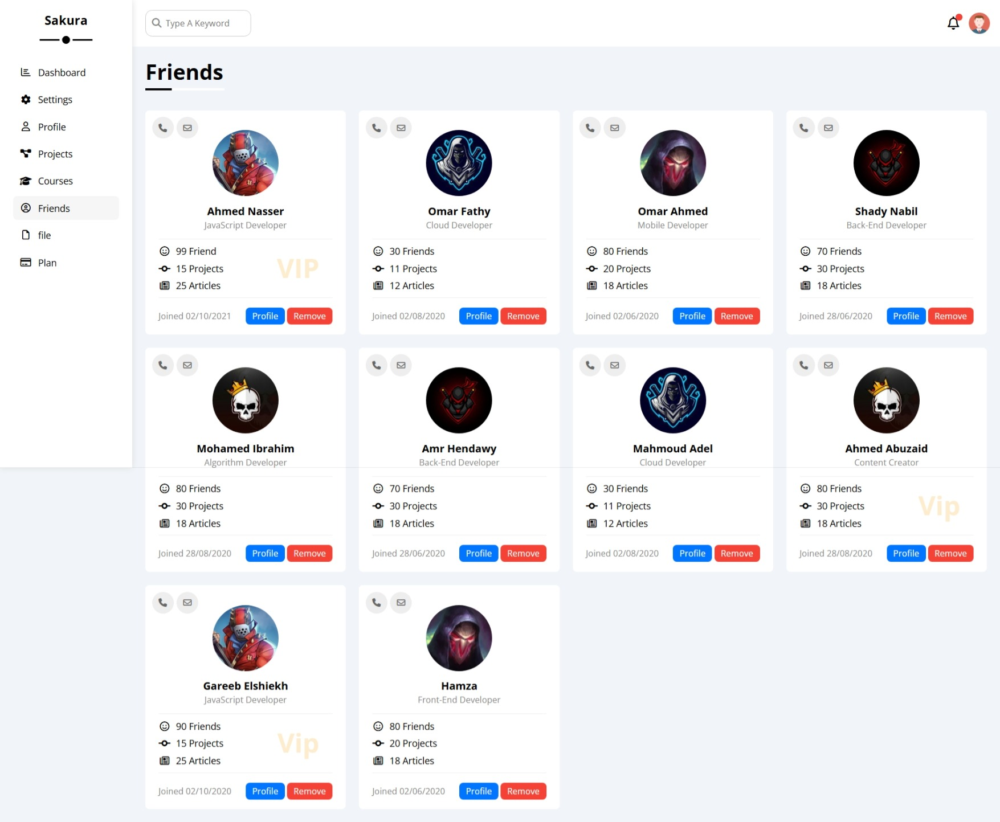
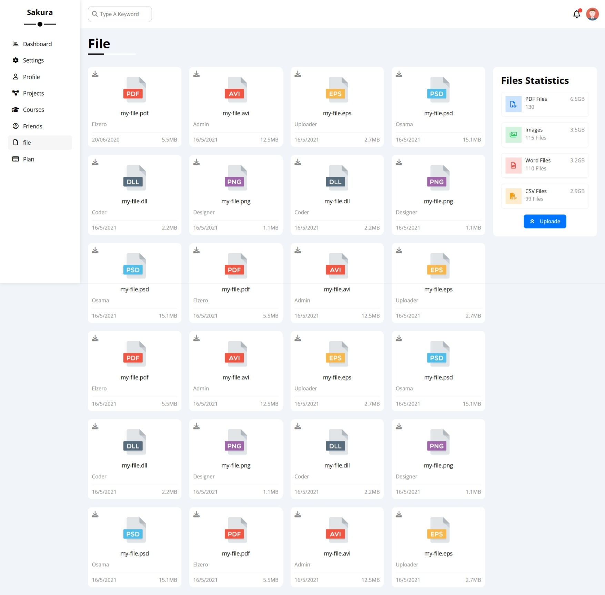
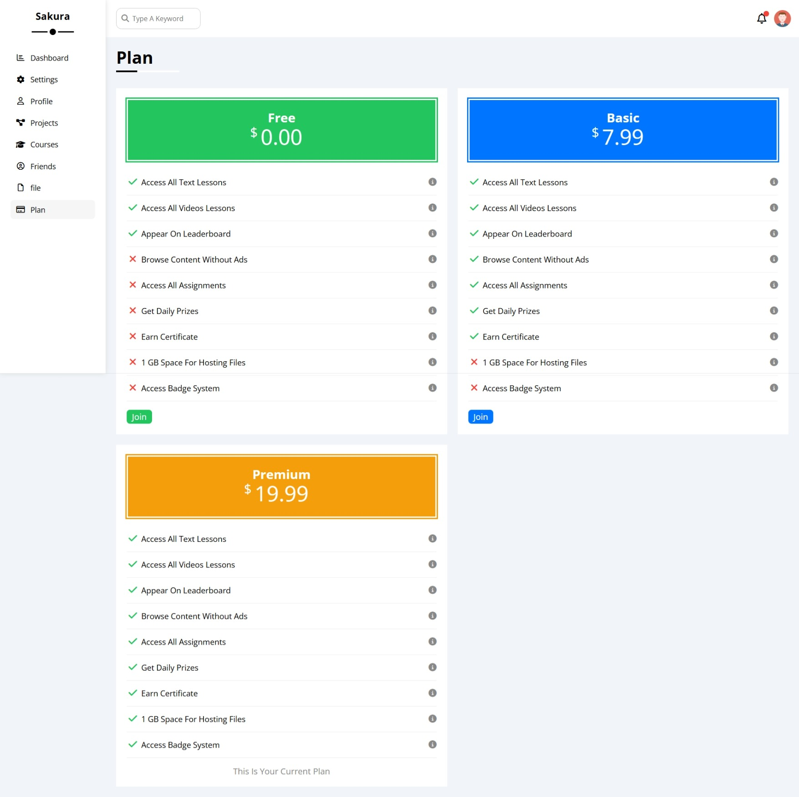

# Sakura Dashboard

A modern and clean admin dashboard built using HTML, CSS, and JavaScript.

---

## 📸 Dashboard Preview

The main dashboard screen that displays all important statistics, tasks, uploads, reminders, latest news, and project progress in one place.

---

## 📂 Pages Overview

Below is a description of each page in the sidebar, with its preview image located inside the **image** folder.

---

### 1️⃣ Dashboard

**Description:**  
The homepage of the system. Contains welcome message, yearly targets, tickets statistics, latest news, latest tasks, uploads, reminders, top search items, social stats, and project table.

---

### 2️⃣ Settings

**Description:**  
Page for managing all system and user settings including account preferences, security settings, notifications, privacy control, site preferences, and backup options.

---

### 3️⃣ Profile

**Description:**  
Displays the full user profile: personal information, job title, skills list, activities history, achievements, statistics, and account details.

---

### 4️⃣ Projects

**Description:**  
A full list of all projects with detailed information: project name, deadline, client, price, team members, and current status (pending, completed, in progress, rejected).

---

### 5️⃣ Courses

**Description:**  
Shows all available courses with thumbnails, instructor names, number of lessons, duration, and enrolled students. A clean grid layout to browse courses easily.

---

### 6️⃣ Friends

**Description:**  
A page that displays all friends in card format. Shows their profile information, job title, contact methods, last activity, and quick action buttons.

---

### 7️⃣ Files

**Description:**  
File manager showing all uploaded files grouped by type. Includes file size, upload date, uploader name, and quick download or delete actions. Also contains file statistics in the sidebar.

---

### 8️⃣ Plans

**Description:**  
Subscription plans page displaying three pricing tiers (Basic, Standard, Premium). Shows features included in each plan with highlighted differences and action buttons for upgrading.

---

## 🚀 Features

- Fully responsive modern dashboard layout
- Statistics widgets and progress bars
- Tasks & project management system
- File upload and file manager
- Social media statistics cards
- Notifications & reminders section
- Clean and organized UI components

---

## 📁 Images Location

All preview images must be placed in:
